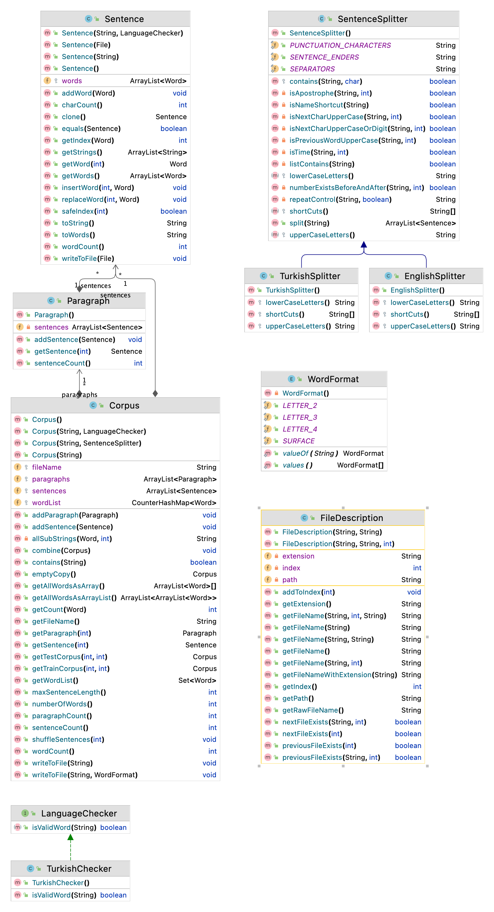

Corpus
============

Video Lectures 
============

Class Diagram
============

For Developers
============

You can also see [Python](https://github.com/starlangsoftware/Corpus-Py), [Cython](https://github.com/starlangsoftware/Corpus-Cy), [C++](https://github.com/starlangsoftware/Corpus-CPP), [Swift](https://github.com/starlangsoftware/Corpus-Swift), [Js](https://github.com/starlangsoftware/Corpus-Js), or [C#](https://github.com/starlangsoftware/Corpus-CS) repository.

## Requirements

* [Java Development Kit 8 or higher](#java), Open JDK or Oracle JDK
* [Maven](#maven)
* [Git](#git)

### Java 

To check if you have a compatible version of Java installed, use the following command:

    java -version
    
If you don't have a compatible version, you can download either [Oracle JDK](https://www.oracle.com/technetwork/java/javase/downloads/jdk8-downloads-2133151.html) or [OpenJDK](https://openjdk.java.net/install/)    

### Maven
To check if you have Maven installed, use the following command:

    mvn --version
    
To install Maven, you can follow the instructions [here](https://maven.apache.org/install.html).      

### Git

Install the [latest version of Git](https://git-scm.com/book/en/v2/Getting-Started-Installing-Git).

## Download Code

In order to work on code, create a fork from GitHub page. 
Use Git for cloning the code to your local or below line for Ubuntu:

	git clone <your-fork-git-link>

A directory called Corpus will be created. Or you can use below link for exploring the code:

	git clone https://github.com/starlangsoftware/Corpus.git

## Open project with IntelliJ IDEA

Steps for opening the cloned project:

* Start IDE
* Select **File | Open** from main menu
* Choose `Corpus/pom.xml` file
* Select open as project option
* Couple of seconds, dependencies with Maven will be downloaded. 

## Compile

**From IDE**

After being done with the downloading and Maven indexing, select **Build Project** option from **Build** menu. After compilation process, user can run Corpus.

**From Console**

Go to `Corpus` directory and compile with 

     mvn compile 

## Generating jar files

**From IDE**

Use `package` of 'Lifecycle' from maven window on the right and from `Corpus` root module.

**From Console**

Use below line to generate jar file:

     mvn install

## Maven Usage

        <dependency>
            <groupId>io.github.starlangsoftware</groupId>
            <artifactId>Corpus</artifactId>
            <version>1.0.1</version>
        </dependency>

Detailed Description
============

+ [Corpus](#corpus)
+ [TurkishSplitter](#turkishsplitter)

## Corpus

To store a corpus in memory

	a = Corpus("derlem.txt");

If this corpus is split with dots but not in sentences

	Corpus(String fileName, SentenceSplitter sentenceSplitter)

To eliminate the non-Turkish sentences from the corpus

	Corpus(String fileName, LanguageChecker languageChecker)

The number of sentences in the corpus

	int sentenceCount()

To get ith sentence in the corpus

	Sentence getSentence(int index)

## TurkishSplitter

TurkishSplitter class is used to split the text into sentences in accordance with the . rules of Turkish.

	ArrayList<Sentence> split(String line);
